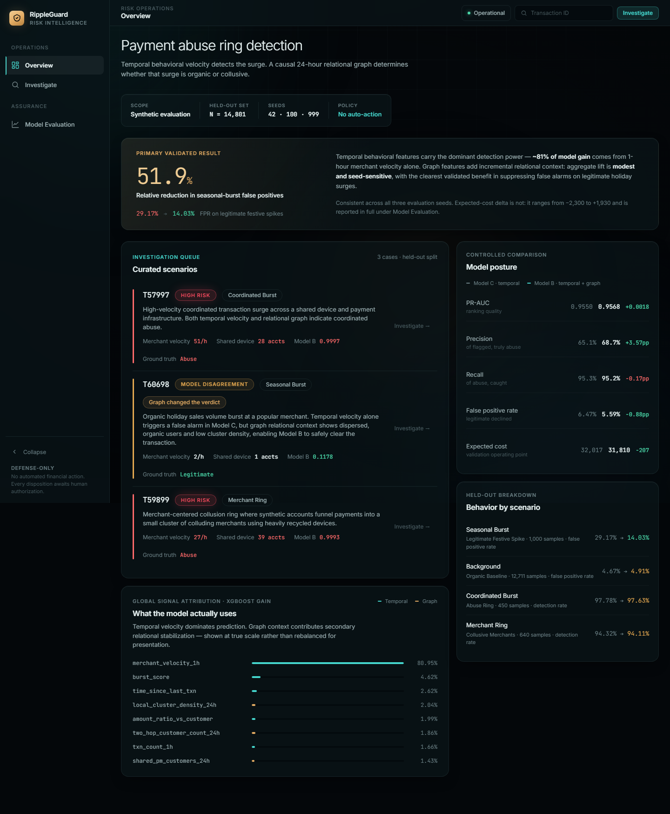
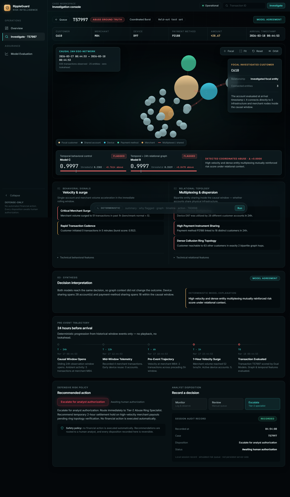
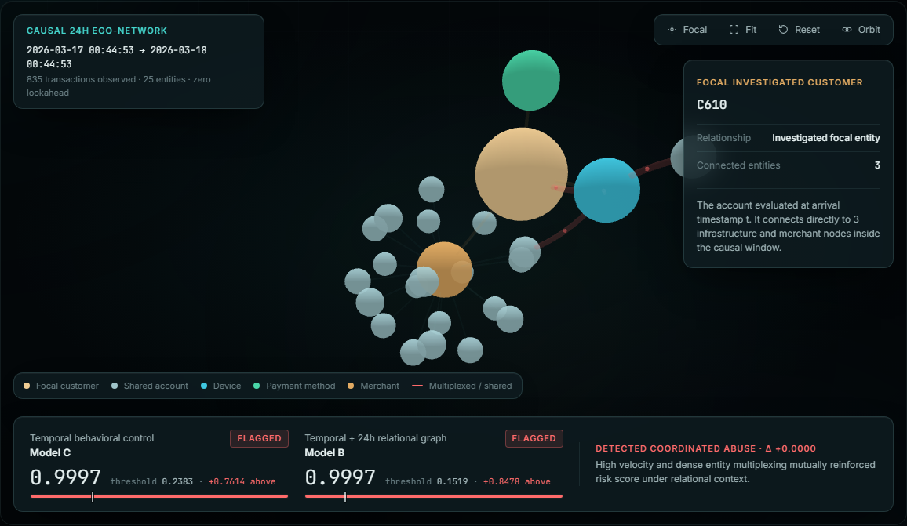
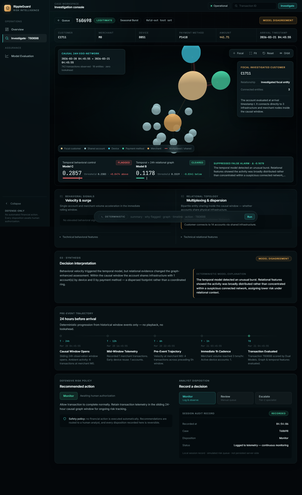
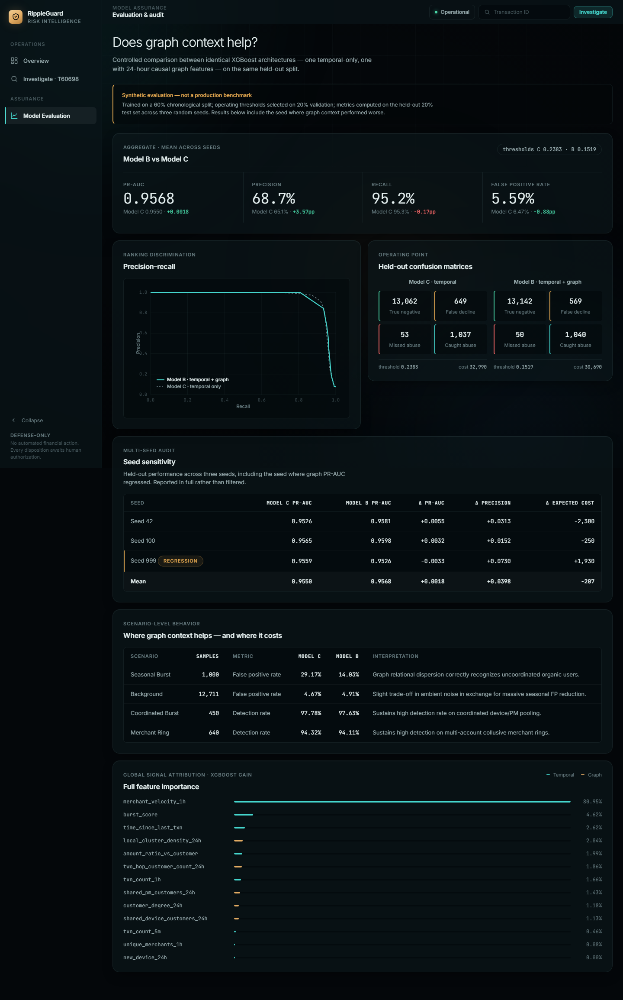

# RippleGuard

> **AI-Powered Financial Risk Intelligence**

RippleGuard is an AI-assisted payment risk investigation workspace that uses temporal behavioral signals and causal 24-hour graph context to detect and explain financial abuse.


> RippleGuard''s command dashboard surfaces system-wide risk, active investigations, suspicious activity, and network signals in a single analyst workspace, allowing investigators to move from aggregate risk to individual cases without losing context.

---

### Context & Operational Posture

| Attribute | Specification |
| :

---

## 1. The Problem

Modern payment fraud presents two conflicting failure modes in transaction-level scoring:

1. **Distributed Syndicate Attacks**: Organized fraud syndicates split volume across dozens of synthetic customer identities, rotating virtual cards and devices to keep single-account velocity deceptively low.
2. **Flash Sale False Positive Spikes**: High-velocity promotional campaigns and festive flash sales cause benign organic buyers to mimic abusive velocity surges. Unaugmented tabular models trigger aggressive false declines, inflicting severe merchant friction and lost revenue.

---

## 2. RippleGuard: The Solution

RippleGuard is architected as a **defense-only decision support tool** to solve these failure modes. 

**The Core Thesis:**
- **Temporal behavioral velocity detects the surge** (~81% feature gain from 1-hour merchant velocity).
- **Causal 24-hour relational graph context determines coordination** (distinguishing concentrated infrastructure reuse from dispersed organic purchasing).
- **Human review remains the final authority** (no automated account termination, card cancellation, or settlement blocking).

---

## 3. How the Product Works

The analyst investigation follows a deterministic, evidence-grounded sequence:

`	ext
Cases Overview
      │
      ▼
Select Investigation Scenario (e.g. Case C / T60698)
      │
      ▼
Compare Dual Model Decisions (Model C vs. Model B)
      │
      ▼
Inspect Behavioral Telemetry (1h velocity, burst score, amount ratio)
      │
      ▼
Inspect Relational Context (Shared devices, shared cards, 2-hop reach)
      │
      ▼
Explore Interactive 3D Causal Ego-Network (Orbit, zoom, inspect entities)
      │
      ▼
Trace 24-Hour Pre-Event Trajectory (Deterministic event timeline with zero lookahead)
      │
      ▼
Record Analyst Disposition (Log human authorization into local session audit trail)
      │
      ▼
Optionally Inspect Model Evaluation (Audit PR curves, seed sensitivity & cost trade-offs)
`

---

## 4. Why Temporal + Graph Intelligence

RippleGuard incorporates an interactive **3D Causal Ego-Network** rendered via WebGL:

`	ext
           [ Shared Device D851 ]
                  /      \
                 /        \
[ Customer C1711 (Focal) ]  [ Customer C1842 ]
                 \
                  \
           [ Merchant M0 ]
`

### Technical Design & Capabilities

- **Zero-Lookahead Construction**: Graph state strictly represents transactions recorded in the causal pre-event window $[t - 24\text{h}, t)$ prior to transaction arrival at timestamp $. Subsequent transactions are mathematically excluded.
- **Bipartite Entity Graph**: Projects customers, merchants, physical devices, and payment instruments as distinct 3D nodes connected by directed transaction and usage edges.
- **Interactive Controls**: Full 3D spatial rotation, smooth perspective scaling, auto-fit, and focal centering.

> **Methodological Clarification**: Graph topology alone does **not** detect abuse. The graph provides an **incremental relational context layer** that validates or suppresses velocity alerts triggered by the primary temporal behavioral model.

---

## 5. Product Experience

RippleGuard guides analysts through a structured, evidence-grounded risk decision workflow rather than operating as an autonomous blocking engine.

### Investigation Workspace


> **Investigation Workspace**: The investigation workspace brings together the selected entity''s risk score, behavioral evidence, connected entities, suspicious activity, and recommended actions so analysts can move from detection to investigation without switching contexts.

### Graph Intelligence


> **Interactive Graph Investigation**: RippleGuard''s interactive network view exposes relationships between customers, merchants, devices, and payment instruments, helping analysts identify connected patterns that transaction-level analysis alone can miss.

### Explainability & Analyst Action


> **Explainability & Recommended Action**: Each flagged case is supported by evidence-based reasoning and a defensive recommendation, giving analysts a transparent basis for review while keeping the final financial decision under human control.

### Risk Analytics & Model Evaluation


> **Model Evaluation & Performance**: The analytics view exposes the evidence behind the detection system, including model performance, classification behavior, and evaluation metrics used to assess the detector on held-out data.

---

## 6. Curated Case Studies

### Case A (`T57997`) — Coordinated Burst Abuse (Model Agreement)
- **Telemetry**: ₹1,240.00 transaction at merchant `M84`.
- **Behavioral Signal**: Single-account velocity spikes to 52 transactions/hour.
- **Relational Evidence**: Physical device `D97` is multiplexed across 28 distinct customer accounts in 24 hours.
- **Model Decisions**: Model C score = `1.0000` (Flagged), Model B score = `1.0000` (Flagged).
- **Assessment**: Coordinated abuse indicated (high confidence).
- **Analyst Action**: **Escalate for Analyst Authorization** (recommends settlement hold on merchant payouts pending specialist review).

### Case C (`T60698`) — Seasonal Volume Burst (Model Disagreement)
- **Telemetry**: ₹4,820.00 festive checkout at merchant `M0`.
- **Behavioral Signal**: Merchant volume surge trips the temporal velocity baseline.
- **Model C Decision**: Risk score **`0.2857`** > threshold `0.2383` $\to$ **FLAGGED (False Alarm)**.
- **Relational Evidence**: Customer interacts across isolated infrastructure (0 shared payment methods, 1 shared device, isolated merchant link).
- **Model B Decision**: Risk score **`0.1178`** < threshold `0.1519` $\to$ **CLEARED (Legitimate)**.
- **Risk Delta**: **$\Delta = -0.1679$** (`LOWER RISK UNDER RELATIONAL CONTEXT`).
- **Analyst Action**: **Monitor** (allows transaction to complete normally; prevents false decline).

### Case B (`T59899`) — Collusive Merchant Ring
- **Telemetry**: ₹2,150.00 transaction at merchant `M12`.
- **Behavioral Signal**: Velocity reaches 18 transactions/hour.
- **Relational Evidence**: Device recycled across 6 synthetic buyer accounts targeting collusive merchants.
- **Model Decisions**: Both models flag high risk; relational topology reinforces synthetic coordination.
- **Analyst Action**: **Analyst Review** (routed to queue for credential inspection).

---

## 7. Synthetic Data Generation & Audit Scope

To evaluate network hypotheses under rigorous, controlled conditions, a multi-scenario synthetic dataset generator was implemented in `src/data.py`:

- **Dataset Scale**: 69,270 transactions across 90 days.
- **Entity Pool**: 2,000 customers, 100 merchants, 1,000 devices, 2,500 payment instruments.
- **Class Balance**: 95.28% legitimate (66,000 transactions), 4.72% abusive (3,270 transactions).
- **Scenario Breakdown**:
  - `coordinated_burst`: Abusive burst targeting merchants via shared physical devices and cards.
  - `merchant_ring`: Collusive merchant ring operating with synthetic buyer accounts.
  - `seasonal_burst`: High-velocity holiday sales with natural, dispersed customer-merchant overlap.
  - `background`: Ambient organic transaction stream.
- **Strict Chronological Splits** (Zero data shuffle):
  - **Train**: 60% (39,756 transactions)
  - **Validation**: 20% (14,713 transactions)
  - **Held-Out Test**: 20% (14,801 transactions)

> **Synthetic Evaluation Disclosure**: This project is evaluated on synthetic data and is not a production benchmark. Real-world payment networks exhibit residential proxy rotations, missing telemetry, and complex behavioral noise not fully present in synthetic generators.

---

## 8. Temporal Leakage Controls

To ensure strict scientific integrity, all feature extraction incorporates zero-lookahead temporal controls:

- **Pre-Event State Commitment**: For any transaction at timestamp $t$, causal graph features are computed from the historical graph state **strictly before** the transaction's edges are committed. Customer degree and neighborhood reach reflect only prior events.
- **Incremental FIFO Sliding Window**: Edges outside the sliding $[t - 24\text{h}, t)$ window are automatically evicted from memory via a FIFO queue (`collections.deque`).
- **Deterministic Timestamp Tie-Breaking**: Transactions arriving at identical second timestamps are sequenced deterministically by arrival order, replicating an event-streaming message bus.
- **Zero Future Contamination**: Rolling behavioral states and graph windows do not leak from test to train. Verified by automated regression tests in `tests/test_graph.py`.

---

## 9. Experiment Ladder & Model Methodology

The project evaluates four benchmark tiers to isolate incremental signal value:

1. **Model 0 (Naive Heuristic Floor)**: Non-ML rule (`merchant_velocity_1h >= 2.0`) selected on the validation set to minimize expected cost under $\text{Recall} \ge 0.80$.
2. **Model A (Linear Baseline Floor)**: Balanced Logistic Regression on temporal features, assessing linear separability.
3. **Model C (Temporal XGBoost Control)**: Gradient boosted trees (`max_depth=4`, `learning_rate=0.1`) trained exclusively on temporal behavioral features.
4. **Model B (Temporal + Graph XGBoost)**: Identical architecture and hyperparameters as Model C, augmented with 5 causal 24-hour relational graph features:
   - `customer_degree_24h`
   - `shared_device_customers_24h`
   - `shared_pm_customers_24h`
   - `two_hop_customer_count_24h`
   - `local_cluster_density_24h`

> **Controlled Graph Experiment**: The isolated experiment is **Model C vs. Model B**. Both share identical training splits, temporal features, and XGBoost hyperparameters. Model 0 and Model A provide benchmark reference floors.

Operating thresholds are selected **strictly on the validation set** to minimize operational cost under $\text{Recall} \ge 0.80$, then frozen for evaluation on the held-out test set ($N = 14,801$).

---

## 10. Validated Results

### Controlled Benchmark: Model C vs. Model B (3-Seed Mean)

Across the 3-seed evaluation audit on the held-out test set ($N = 14,801$):

| Evaluation Metric | Model 0 (Naive Floor) | Model A (LR Floor) | Model C (Temporal Control) | Model B (Temporal + Graph) | Delta ($\text{C} \to \text{B}$) | Operational Implication |
| :

---

## 11. Multi-Seed Sensitivity Audit

To verify stability, identical pipelines were executed across three distinct random seeds:

| Seed | Model C PR-AUC | Model B PR-AUC | PR-AUC Delta | Precision Delta | Expected Cost Delta |
| :

---

## 12. Feature Importance Attribution

Empirical analysis of XGBoost feature gain reveals the relative contribution of each signal family:

| Feature Name | Signal Type | XGBoost Gain Share | Role in Detection |
| :

---

## 13. Safety & Responsible AI Protocol

RippleGuard is architected strictly as a **defense-only decision support tool**:

- **No Autonomous Financial Action**: The system does **not** autonomously execute settlement holds, block credit cards, freeze merchant payouts, or terminate user accounts.
- **Human-in-the-Loop Protocol**: All model predictions are mapped to operational recommendations (`Monitor`, `Analyst Review`, `Escalate for Authorization`). Every financial action requires explicit human authorization.
- **Auditable Action Logging**: Analyst disposition choices are recorded in a local session audit log to ensure complete traceability.
- **Reversible Interventions**: Recommendations emphasize reversible risk mitigation (step-up 2FA, manual review, temporary hold authorization) rather than permanent account punitive actions.

---

## 14. System Architecture

```
                               Live Transaction Request [t]
                                           │
                   ┌───────────────────────┴───────────────────────┐
                   ▼                                               ▼
      Temporal Behavioral Engine                     Causal 24h Relational Graph
    (Rolling 5m, 1h, Expanding Medians)              (Sliding Window [t - 24h, t])
    ──────────────────────────────────             ──────────────────────────────────
    • txn_count_5m, txn_count_1h                   • customer_degree_24h (Strictly Prior)
    • burst_score, time_since_last_txn             • shared_device_customers_24h
    • merchant_velocity_1h (Dominant Signal)       • shared_pm_customers_24h
    • amount_ratio_vs_customer                     • two_hop_customer_count_24h
                                                   • local_cluster_density_24h
                   │                                               │
                   └───────────────────────┬───────────────────────┘
                                           ▼
                          Fused Feature Vector (13 Features)
                                           │
                                           ▼
                          XGBoost Graph-Enhanced Model (B)
                                           │
                         ┌─────────────────┴─────────────────┐
                         ▼                                   ▼
              Model Probability vs Threshold       Deterministic Explainability Engine
              (Validation-Frozen Threshold)       (Zero Hallucination Rule Attribution)
                         │                                   │
                         └─────────────────┬─────────────────┘
                                           ▼
                            Reversible Defensive Action
                     ┌─────────────────────┬─────────────────────┐
                     ▼                     ▼                     ▼
              [ MONITOR ]          [ ANALYST REVIEW ]      [ ESCALATE FOR AUTHORIZATION ]
           (Organic Baseline)    (Step-up 2FA/3DS Queue)   (Human Review; Settlement Hold Rec)
                                                                  │
                                           ┌──────────────────────┴──────────────────────┐
                                           ▼                                             ▼
                           [ Human Analyst Authorized ]                    [ No Auto-Financial Action ]
```

---

## 15. Technology Stack

- **Machine Learning & Analytics**: Python 3.14, XGBoost, Scikit-learn, NetworkX, NumPy, Pandas.
- **API & Backend Service**: FastAPI, Uvicorn, Pydantic.
- **Frontend Architecture**: Semantic HTML5, Vanilla CSS (Dark Slate Design System with CSS variables), Vanilla JavaScript (ES6+).
- **Network Visualization**: 3D WebGL Force-Directed Graph (`3d-force-graph` / Three.js), HTML5 Canvas 2D fallback.
- **Testing & Verification**: Pytest, AnyIO.

---

## 16. Setup & Reproduction Commands

### Environment Setup

```bash
# 1. Clone the repository
git clone https://github.com/Dr-Dre420/abuse-ring-sentinel.git
cd abuse-ring-sentinel

# 2. Create and activate virtual environment
python -m venv venv
.\venv\Scripts\activate      # Windows
# source venv/bin/activate   # Linux/macOS

# 3. Install pinned dependencies
pip install -r requirements.txt
```

### Run Automated Tests

Execute the 24-test regression suite to verify graph determinism, leakage guards, API contracts, and defensive safety:

```bash
pytest -v
```

### Launch the Risk Investigation Workspace

Start the local FastAPI development server:

```bash
python -m uvicorn src.api:app --host 127.0.0.1 --port 8000 --reload
```

Open your browser and navigate to:
```
http://localhost:8000
```

---

## 17. API Reference

| Endpoint | Method | Description |
| :

---

## 18. Repository Structure

```
abuse-ring-sentinel/
├── README.md                      # Engineering report & submission documentation
├── LICENSE                        # All Rights Reserved (Arnav Jain)
├── .env.example                   # Environment configuration template
├── .gitignore                     # Git hygiene rules
├── requirements.txt               # Pinned Python package dependencies
├── artifacts/
│   ├── evaluation/                # Frozen metrics, static payloads & audit reports
│   └── models/                    # Trained XGBoost models & validation thresholds
├── assets/
│   └── screenshots/               # High-resolution screenshots of final UI/UX
│       ├── 3d_causal_ego_network.png
│       ├── cases_overview.png
│       ├── case_a_investigation.png
│       ├── case_c_disagreement.png
│       └── model_evaluation.png
├── configs/
│   └── config.py                  # Pipeline paths, parameters & costs
├── src/
│   ├── api.py                     # FastAPI service & evaluation endpoints
│   ├── cases.py                   # Case telemetry, timeline & explanation logic
│   ├── data.py                    # Multi-scenario synthetic transaction generator
│   ├── features.py                # Causal 24h bipartite graph feature extractor
│   ├── evaluate.py                # Multi-seed audit & evaluation suite
│   ├── model_0.py                 # Naive single-signal heuristic baseline evaluation
│   ├── train.py                   # Model training & threshold selection
│   └── static/
│       ├── index.html             # Risk Investigation Workspace
│       ├── styles.css             # Dark slate visual design system
│       ├── app.js                 # Workspace logic, 3D WebGL & 2D canvas fallback
│       └── vendor/
│           └── 3d-force-graph.min.js
└── tests/
    ├── test_graph.py              # Zero-leakage temporal regression tests
    ├── test_model_0.py            # Model 0 deterministic validation & test assertions
    ├── test_p2_dashboard_api.py   # API contracts, Case C values & safety tests
    └── test_smoke.py              # Core endpoint smoke tests
```

---

## License

Copyright © 2026 Arnav Jain.  
All rights reserved.

See [LICENSE](file:///c:/Learning/College/Others/Hackathon/Razorpay/Project/abuse-ring-sentinel/LICENSE) for the full terms.
